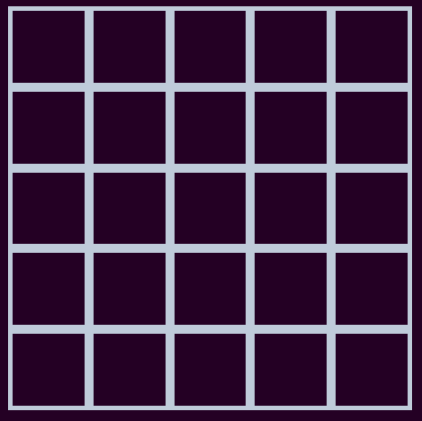
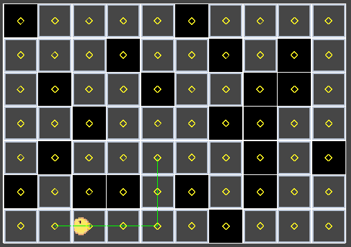
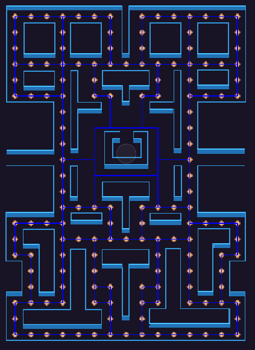
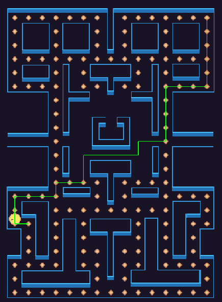

# Lost In The Maze

This project demonstrates pathfinding using the A* algorithm in a Pacman-inspired environment. It includes a grid setup that can be dynamically changed, random obstacles that may block the path (refresh to test with a clear path grid), and a visualization of the A* algorithm finding the shortest path.

## Features

1. **Grid Setup**: Utilize a dynamic grid setup representing various environments.
   
2. **Random Obstacles**: Generate random obstacles that may block the path. Refresh the grid for testing with a clear path.

3. **A* Algorithm**: Implement the A* algorithm to find the shortest path from start to target position on the grid.

4. **Pacman Visual**: Includes a Pacman scene with a working Pacman character, resembling the original game.

5. **Pathfinding Visualization**: Observe the pathfinding process in the scene view, illustrating how the algorithm navigates the grid to find the optimal path.

## Usage

1. Clone the repository to your local machine:

git clone https://github.com/your_username/pacman-pathfinding.git

2. Open the project in Unity Editor (version 2022.3.15f1 or higher).

3. Navigate to the "LostInMaze Test Task Scene" to visualize the pathfinding process in a grid setup.

4. Modify the grid setup as desired and observe how the A* algorithm adapts to find the shortest path around obstacles.

5. Refresh the grid to test different scenarios with clear paths.

To navigate Pacman in the maze using the keyboard or arrow keys, access the "Pacman Scene" within the project. This scene aims to replicate the original mechanics of Pacman. Note that AI behavior is currently under development and will be implemented in future updates.

## Examples

### Lost In Maze
- **Description**: A procedural grid generated with specific dimensions and cell sizes. Players navigate from point A to point B using the A* algorithm. The path updates dynamically when new nodes are clicked.

### Pacman Grid
- **Description**: Auto neighbor assigning creates pathways for players to navigate, ignoring obstacles or non-walkable nodes. Similar allocation as in the Lost in Maze grid.

Pacman can move using WASD and arrow keys, utilizing the A* algorithm to navigate the grid.

These dynamic grid setups demonstrate different scenarios where players can navigate through the maze using A* algorithm, providing interactive and engaging experiences.
